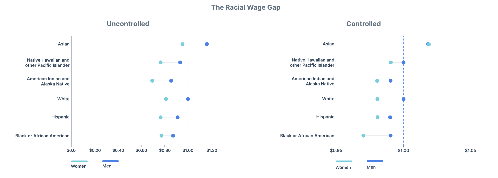
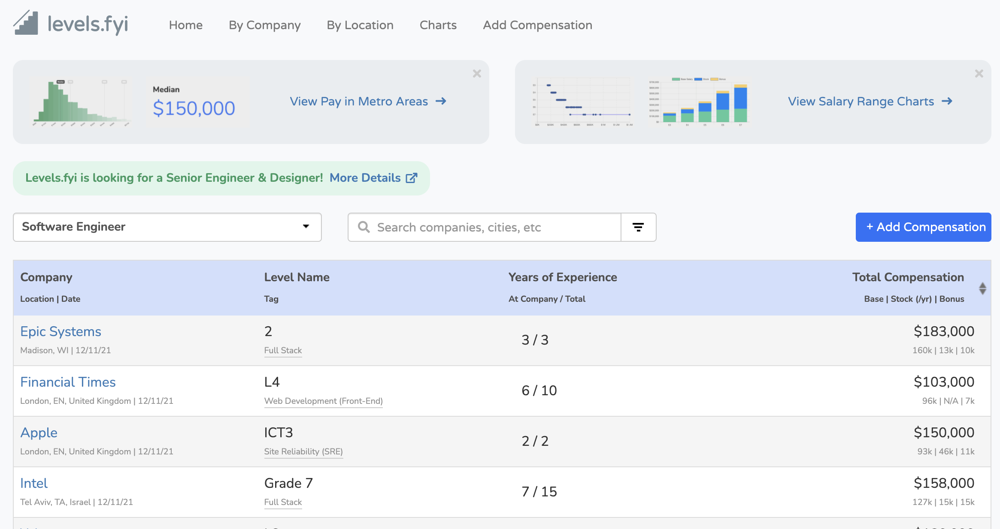

---
output:
  html_document: default
  pdf_document: default
---

<center> <font size = "5"> **Analyzing the Effects of Gender and Race on Compensation in the Tech Industry Using Data from Levels.FYI** </font></center> 


#### Sofia Zaidman
#### 12/18/2021


```{r setup, include=FALSE,warning=FALSE}
knitr::opts_chunk$set(warning = FALSE, message = FALSE) 
```

### Background
In the midst of a historic uprooting of the job market, questions related to salary and fair pay have never been more relevant or more prominent in daily conversation. “The Great Resignation” associated with the COVID-19 pandemic has emboldened the American workforce to shed the outdated taboo of keeping one’s salary private and to demand more from employers. 

Consideration of changing demographics in the labor market is crucial to understanding the current cultural shift in pay transparency. As women continue to outnumber men in college degrees awarded and enter the workforce in greater numbers, more light is shed on the gender pay gap in white-collar industries. Similarly, the racial and generational makeup of the office workplace is rapidly moving away from the middle-aged, white “standard” of the 20th century. As historically disadvantaged demographic groups rise to greater prominence in historically white male workplaces, urgency in uncovering pay disparities increases.

The tech industry is an obvious target to examine such disparities. Highly desirable, high-paying jobs that tout benefits like stock options, education reimbursement and the ability to work remotely attract the best and brightest to the field, regardless of race, gender, or age. Of course the modern tech industry has its own historical demographic disparities, skewing heavily toward White and Asian men. However, the high demand for skilled tech workers and increasing levels of interest and access to tech education across all genders and races is rapidly shifting the face of the industry. 

Data from The U.S. Bureau of Labor Statistics highlights shifts in the racial makeup of Computer and Mathematical Professions in recent years. Since 2018, the yearly percent increase in Black employed persons in the field has more than doubled from 4% to 9%, while both White workers and Asian workers have seen a decline in growth. Racial groups that have historically been excluded from the tech field are gaining momentum in representation as the industry continues to expand. 


```{r graphic, echo = FALSE,fig.align ='center'}
library(ggplot2)
library(dplyr)
raceyear <- read.csv("raceyear.csv")
raceyear$Year <- as.character(raceyear$Year)

raceyear <- dplyr::filter(raceyear, raceyear$Year %in% c("2018","2019","2020"))

cols <- c("2018" = "indianred4", "2019" = "indianred3", "2020" = "indianred1")

#plot of year over year changes in computer and math workforce by race
ggplot(raceyear, aes(fill= Year, y=Percent, x=Race)) + 
  geom_bar(position="dodge", stat="identity") + 
  theme_minimal() + 
  scale_fill_manual(values = cols) +
  ggtitle("Yearly Percent Increase in Computer and \nMathematics Workforce by Race") + 
  labs(y="Percent Increase", x= "") +
  theme(plot.title = element_text(hjust = 0.5)) + 
  scale_y_continuous(labels = scales::percent, breaks = scales::pretty_breaks(n = 10))


```

#### Current Gender and Wage gaps in the US

In their 2021 Gender and Pay Gap Report, which analyzes pay disparities in the US across all industries via crowdsourced data, PayScale found that, without adding any control variables, women make 82𝇍 for every dollar earned by men. After adding control variables, women made 98𝇍 for every dollar earned by men, leaving a 2% difference attributable purely to discrimination based on gender. 

PayScale's findings on the racial wage gap show that, with or without control of demographics, both men and women of most races earn less than white men. Interestingly, when controlling for external factors, Asian men and women earn more than any group. The figures below taken from payscale.com illustrate these pay disparities: 

```{r payscale, fig.align = "center", echo = FALSE,fig.cap = "payscale.com"}


```
#### Levels.fyi

Levels.fyi is a website founded in 2017 as a place for tech industry professionals around the world to anonymously share detailed compensation information. In 2020, levels.fyi began collecting race, gender, and education information from users along with salary information. 

```{r levels, fig.align = "center", echo = FALSE,fig.cap = "levels.fyi"}


```

### Hypothesis and Methodology

Using data from levels.fyi, I am interested in answering the question: can any of the variance in compensation in the tech industry be explained by racial and gender differences? If so, how much of this variance can be attributed to differences in years of experience, job title, educational attainment, and cost of living between genders and racial groups?

My hypothesis going into this analysis is that race and gender will remain significant predictors of total annual compensation when controlling for years of experience, education, and cost of living. Based on the data from PayScale, I predict that men in the levels.fyi dataset will be compensated on average approximately 2% more than women after adding controls. I predict that Asian posters will be compensated on average approximately 2% more than White posters, while Black posters will be compensated on average approximately 6% less than White posters, and Hispanic posters approximately 4% less than White posters. 

My dependent variable will be total annual compensation, with gender, race, education, total years of experience, years at the current company and cost of living index as independent variables.

The sample that I will use comes from a comprehensive dataset of scraped salary postings from levels.fyi. The data was posted to Kaggle.com and is available [here](https://www.kaggle.com/jackogozaly/data-science-and-stem-salaries). I have limited my analysis to jobs in the US and removed NA values for our target independent variables, gender and race. I have also removed records with total yearly compensation equal to 0. I have joined this data to a separate table with cost of living index values by US state.

#### Explanation of variables

* **Total Yearly Compensation** (totalyearlycompensation): Total yearly compensation in US dollars; sum of base salary, stock grant value and bonus. Numeric.

* **Base Salary** (basesalary): Base salary in US dollars. Values of $0 have been removed. Numeric.

* **Stock Grant Value** (stockgrantvalue): Stock grant value in US dollars. Numeric.

* **Bonus** (bonus): Bonus in US dollars. Numeric.

* **Gender** (gender): Gender can be “Male”, “Female” or “Other”. NA values have been removed. Nominal.

* **Race** (Race): Race can be “Asian”, “Black”, “Hispanic”, “Two or More”, or “White”. NA values have been removed. Nominal.

* **Years of Experience** (yearsofexperience): Total years of work experience. Integer.

* **Years at Company** (yearsatcompany): Years working at the current company. Integer.

* **Education** (Education): Education can be “Highschool”, “Some College”, “Bachelor’s Degree”, “Master’s Degree” or “PhD”. NA values have been removed. Nominal

* **Year** (Year): All records in our sample were posted in 2020 or 2021. Nominal.

* **Title** (title): Job title can be "Business Analyst", "Data Scientist", "Hardware Engineer", "Human Resources", "Management Consultant", "Marketing", "Mechanical Engineer", "Product Designer", "Product Manager", "Recruiter", "Sales", "Software Engineer", "Software Engineering Manager", "Solution Architect", and "Technical Program Manager". Nominal.

* **Cost of Living Index** (Index): Cost of living index by US State comes from The Council for Community and Economic Research from Q3 of 2021. The average cost of living index for the US is 100. States with cost of living greater than 100 have above average cost of living, those below 100 have below average cost of living. Numeric. 

#### Numeric Variable Descriptives
```{r wrangle, echo = FALSE,fig.align ='center'}

library(dplyr)
library(tidyr)
library(psych)

levels <- read.csv("levels.csv")
statecol <- read.csv("statecol.csv")

#separate location into city, state (or country), usa (na = not usa)
levels <- levels %>% separate(location, c("City", "State", "Country"), ",")

#make timestamp an actual timestamp
levels$datetime <- strptime(levels$timestamp, "%m/%d/%Y %H:%M", tz = "Europe/London")

#year and month variables
levels$year <- format(levels$datetime, format="%Y")
levels$month <- format(levels$datetime, format="%m")

#clean to get only US data
usa_level <- filter(levels, is.na(Country) == TRUE)
usa_level <- filter(usa_level, State != " Israel")

#base salaray greater than 0
usa_level <- filter(usa_level, basesalary > 0)

#has gender field
usa_level <- filter(usa_level, is.na(gender) == FALSE)

#remove some other NAs
usa_level <- filter(usa_level, is.na(Education) == FALSE)
usa_level <- filter(usa_level, is.na(Race) == FALSE)
usa_level <- filter(usa_level, is.na(datetime) == FALSE)
usa_level <- filter(usa_level, is.na(gender) == FALSE)
usa_level <- filter(usa_level, is.na(title) == FALSE)
usa_level <- filter(usa_level, is.na(yearsofexperience) == FALSE)
usa_level <- filter(usa_level, is.na(yearsatcompany) == FALSE)
#recode the education variable 
usa_level$education.recode.ordinal <- recode(usa_level$Education, "Highschool" = 1, "Some College" = 2, "Bachelor's Degree" = 3, "Master's Degree" = 4, "PhD" = 5)
usa_level$education.recode.numeric <- recode(usa_level$Education, "Highschool" = 12, "Some College" = 14, "Bachelor's Degree" = 16, "Master's Degree" = 18, "PhD" = 20)

#getting the COL data
statecol$stateid <- trimws(statecol$ABBR)
usa_level$stateid <- trimws(usa_level$State)
usa_level_col <- merge(usa_level, statecol, by = "stateid")

#rename race and education for no captials
usa_level_col$race <- usa_level$Race
usa_level_col$education <- usa_level_col$Education

```
```{r describe, echo = FALSE,fig.align ='center'}
library(knitr)
library(kableExtra)

description <- usa_level_col %>%
  select(c('yearsofexperience', 'yearsatcompany', 'totalyearlycompensation', 'basesalary','stockgrantvalue','bonus','Index')) %>%
  describe(.)

good <- description %>% select(c('n','mean','sd','median','min','max','range','skew','kurtosis','se'))

kable(good) %>% 
  kable_classic_2(full_width = F, html_font = "Helvetica") %>%
  kable_styling(bootstrap_options = "striped", font_size = 12)
```

The average number of years of experience out of 16,961 posters in the US is 7.2 years. The skew and kurtosis of this variable are relatively low, meaning that it is approximately normally distributed. The average number of years at the poster's current company is 2.8. The skew and kurtosis for this variable are higher than they were for total years of experience - this is acceptable, as normality of independent variables is not an assumption for multiple linear regression. 

The average total annual compensation for our sample is \$222,916, average base salary is \$149,7101, average stock grant value is \$51,641 and bonus is \$20,683. Total annual compensation, base salary, stock grant value and bonus are all heavily skewed in our dataset. Again, this is acceptable. Log transforming Total Yearly Compensation in our models will also increase the normality of this variable. 

The average cost of living index for our sample is 127, meaning that most of the posters to levels.fyi in our sample live in states with a higher than average cost of living. Skew and kurtosis for this variable are relatively low, meaning that it is approximately normally distributed. 

#### Categorical Variable Counts

```{r categorical, echo = FALSE,fig.align ='center'}
#categorical variable summaries
library(janitor)
library(kableExtra)

education <- tabyl(usa_level_col$education, sort = TRUE) %>% adorn_pct_formatting()

kable(education, caption = "Education") %>%
  kable_classic_2(full_width = F, html_font = "Helvetica") %>%
  kable_styling(bootstrap_options = "striped", font_size = 12) 


```

A Bachelor's degree is the most common level of Education in our sample, followed very closely by Master's degree. PhDs account for about 5% of the sample. There are very few cases with education below the level of a Bachelor's degree.

```{r categorical2, echo = FALSE,fig.align ='center'}
gender <- tabyl(usa_level_col$gender, sort = TRUE) %>% adorn_pct_formatting()

kable(gender, caption = "Gender") %>%
  kable_classic_2(full_width = F, html_font = "Helvetica") %>%
  kable_styling(bootstrap_options = "striped", font_size = 12)
```

The majority of cases in our sample identify as Male.

```{r categorical3, echo = FALSE,fig.align ='center'}
race <- tabyl(usa_level_col$race, sort = TRUE) %>% adorn_pct_formatting()

kable(race, caption = "Race") %>%
  kable_classic_2(full_width = F, html_font = "Helvetica") %>%
  kable_styling(bootstrap_options = "striped", font_size = 12)
```

The most common races in our sample are Asian and White, with Black, Hispanic and "Two or More" accounting for less than 13% of cases.

```{r categorical4, echo = FALSE,fig.align ='center'}

year <- tabyl(usa_level_col$year, sort = TRUE) %>% adorn_pct_formatting()

kable(year, caption = "Year") %>%
  kable_classic_2(full_width = F, html_font = "Helvetica") %>%
  kable_styling(bootstrap_options = "striped", font_size = 12)
```

Most of the data in our sample comes from 2021. 

```{r categorical5, echo = FALSE,fig.align ='center'}
title <- tabyl(usa_level_col$title, sort = TRUE) %>% adorn_pct_formatting()

kable(title, caption = "Job Title") %>%
  kable_classic_2(full_width = F, html_font = "Helvetica") %>%
  kable_styling(bootstrap_options = "striped", font_size = 12) 
#%>%
 #   footnote(general = "Here is a general comments of the table. ")
```

Software Engineer is by far the most common job title in our sample, accounting for over 60% of cases. Product Manager is the next most common job title, accounting for 7.4% of cases.

### Uncontrolled Preliminary Models

As an initial model, I will run the following three simple multiple linear regressions:

1. Predicting Total Annual Compensation with Gender (Model 1a):
<div align="center">
<font size = "3" style="font-family:'Times New Roman'">
*ln(Total Annual Compensation) = β0 + β1(Gender)*
</font>
</div>

2. Predicting Total Annual Compensation with Race (Model 1b):
<div align="center">
<font size = "3" style="font-family:'Times New Roman'">
*ln(Total Annual Compensation) = β0 + β2(Race)*
</font>
</div>
3. Predicting Total Annual Compensation with Gender and Race (Model 1c):
<div align="center">
<font size = "3" style="font-family:'Times New Roman'">
*ln(Total Annual Compensation) = β0 + β1(Gender) +  β2(Race)*
</font>
</div>

4. Predicting Total Annual Compensation with Gender, Race and Interaction of Gender and Race (Model 1d):
<div align="center">
<font size = "3" style="font-family:'Times New Roman'">
*ln(Total Annual Compensation) = β0 + β1(Gender) +  β2(Race) + β1(Gender)x β2(Race) *
</font> 
</div>

Note 1: Reference groups for the gender and race variables have been set to "Male" and "White".

Note 2: The dependent variable in the model is the natural log of total annual compensation. Log transforming variables with wide ranges such as income is a standard practice and will allow easier interpretation of model coefficients. 

Note 3: Gender and Race have been written as single variables for simplicity, however because they are categorical variables, they will be dummy-coded in the model and will be represented by several beta values (one for each unique value, except for the reference group).

<div align="center">
#### Preliminary Models 1a, 1b, 1c and 1d

```{r model, echo = FALSE, align ='center', results = "asis"}

usa_level_col$gender <- relevel(factor(usa_level_col$gender), ref = "Male")
usa_level_col$Race <- relevel(factor(usa_level_col$Race), ref = "White")

library(sjPlot)
modela = lm(log(totalyearlycompensation) ~ gender, data=usa_level_col)

modelb = lm(log(totalyearlycompensation) ~  Race, data=usa_level_col)

modelc = lm(log(totalyearlycompensation) ~ gender + Race, data=usa_level_col)

modeld = lm(log(totalyearlycompensation) ~ gender + Race + gender*Race, data=usa_level_col)

tab_model(modela, modelb, modelc, modeld, dv.labels = c("Model 1a", "Model 1b", "Model 1c", "Model 1d"))

#library(stargazer)
#stargazer(model1, type = "html",  #we use html output to match our planned R Markdown output
 #         title = "Model 1")

```
</div>

#### Interpretation of Preliminary Models

The preliminary models use only our target independent variables, gender and race, to predict total annual compensation. Model 1a (gender) has an R^2 value of .008, meaning that .8% of the variance in total annual compensation can be explained by differences in gender. Model 1b (race) also has an R^2 value of .008, meaning that .8% of the variance in total annual compensation can be explained by differences in race. Model 1c (gender and race) has an R^2 value of .016, meaning that 1.6% of the variance in total annual compensation can be explained by differences in gender and race among posters. Although there are minor changes in coefficient values for Race [Asian] and Race [Black] between models 1b and 1c, because the R^2 value of model 1c is exactly equal to the combined R^2 values of models 1a and 1b, we can infer that race and gender are both contributing their own explanatory power to the combined model, and neither variable is mediating the effect of the other in a significant way.

In Model 1c, we can see that net of gender, Black and Hispanic posters had a total yearly compensation on average 17% and 7% less than White posters, respectively. Asian posters had on average 4% higher yearly compensation than White posters. These relationships are all highly significant, with p values below the .001 threshold.  

Model 1d was included to test for a possible interaction between the gender and race variables. Adding the interaction term increased the model's explanatory power by only .1% (unadjusted) - .2% (adjusted). Groups that differed significantly from White men to an extent beyond what can be explained by either the race or gender variables separately were Hispanic posters of gender "Other", female posters of race "Two or More", and posters of gender "Other" and race "Two or More." All coefficients for these groups were positive, meaning that membership in one of these combinations of groups increases total annual compensation beyond what would be expected using  gender and race separately as predictors. Because none of these coefficients were significant at the p < .001 threshold and they add relatively little explanatory power to the model, I am choosing to omit an interaction term between gender and race in subsequent models. 

Without controlling for additional variables, we cannot say with much certainty what is driving these relationships. It could be that the men in our dataset have much more experience than the women in our dataset, and after controlling for years of experience, the magnitude of the coefficient for gender [Female] will decrease. To account for some of these possibilities, I will add the following control variables to our model: Years of Experience, Years at Company, Education, Title, Cost of Living Index. 


### Hierarchical Linear Regression Predicting Total Annual Compensation

Next I will perform a hierarchical linear regression to determine the statistical significance of variance in compensation explained by gender and race. The first step will include only control variables as independent variables to predict total annual compensation. In subsequent models, gender and race will be added as independent variables to the initial model. F-tests between the models will test for the significance of any additional variance explained as gender and race are added. 

The models I will test are written below:

Model 2a:
<font size = "3" style="font-family:'Times New Roman'">
*ln(Total Annual Compensation) = β0 + β1(Years of Experience) +  β2(Years at Company) +  β3(Education) +  β4(Title) + β5(Index)*
</font>

Model 2b:
<font size = "3" style="font-family:'Times New Roman'">
*ln(Total Annual Compensation) = β0 + β1(Years of Experience) +  β2(Years at Company) +  β3(Education) +  β4(Title) + β5(Index) + β6(Gender)*
</font>

Model 2c:
<font size = "3" style="font-family:'Times New Roman'">
*ln(Total Annual Compensation) = β0 + β1(Years of Experience) +  β2(Years at Company) +  β3(Education) +  β4(Title) + β5(Index) + β6(Gender) + β7(Race)*
</font>
<div align="center">
#### Step 1 - control variables only
```{r model1, echo = FALSE, align ='center', results = "asis"}
library(sjPlot)
model1 = lm(log(totalyearlycompensation) ~ yearsofexperience + yearsatcompany + education + title + Index, data=usa_level_col)

tab_model(model1, dv.labels = c("Model 2a"))
#library(stargazer)
#stargazer(model1, type = "html",  #we use html output to match our planned R Markdown output
 #         title = "Model 1")

```
</div>

#### Interpretation of coefficients for control variables

The first step in the hierarchical linear model with control variables Years of Experience, Years at Company, Education, Title, and Index explains 41% of the variance in total annual compensation in our sample. This is a large amount of explanatory power, and almost all of the coefficients associated with the variables are significant with a p value below the .001 threshold. 

As could be predicted, net of other variables, as total years of experience increase, so does total yearly compensation, by 4% per year of experience. Interestingly, posters with a longer tenure at the current company on average see total yearly compensation for new positions decrease by 1% for every year at the company, net of other variables.

Due to their omission, we can infer that the reference group for education is Bachelor’s degree holders, and the reference group for title is Business Analyst. 

Coefficients for the dummy-coded education variables make sense: net of other variables, posters with a Master’s degree are compensated on average 8% higher than those with a Bachelor’s degree. Posters with a PhD are compensated a whopping 34% higher on average than those with a Bachelor’s degree. There is a high degree of variation in compensation between titles, which would also be expected. 

Net of other variables, as the cost of living index for the state in which the job was taken increases, so does total annual compensation, by 1% per index point on average. 

Next I will add gender as an independent variable to this model to determine its effect and significance in explaining total annual compensation when controlling for years of experience, years at the company, education, title, and cost of living.

<div align="center">
#### Step 2 - addition of gender variable to model
```{r model2, echo = FALSE, align ='center', results = "asis"}
library(sjPlot)
model2 = lm(log(totalyearlycompensation) ~ yearsofexperience + yearsatcompany + education + title + Index + gender, data=usa_level_col)

tab_model(model1,model2, dv.labels = c("Model 2a", "Model 2b"))
#library(stargazer)
#stargazer(model1, type = "html",  #we use html output to match our planned R Markdown output
 #         title = "Model 1")

```
</div>

#### Interpretation of coefficients for Model 2b

We can see that the coefficient for gender [Female] has decreased in magnitude from -.11 in the preliminary model to -.07 after adding control variables, though it is still highly significant at the same p value threshold of .001. This means that after controlling for years of experience, years at the company, education, job title and cost of living index, being female still results in a 7% decrease in total yearly compensation on average compared to being male. There is no significant difference in total annual compensation between posters who identified as men and those who identified as “other” gender, likely because this group was so small. It will be interesting to see what effects might come to light as more posters who identify neither as men nor women continue to report compensation on levels.fyi. The addition of gender to the model added only .2% of explanatory power overall. 

```{r model2_f, echo = FALSE, align ='center', results = "asis"}
kable(anova(model1, model2),caption = "F test between Model 2a and Model 2b") %>% 
  kable_classic_2(full_width = F, html_font = "Helvetica") %>%
  kable_styling(bootstrap_options = "striped", font_size = 12)

```

The F test between Model 2a and Model 2b confirms that the addition of gender provided a significant amount of explanatory power to the model.

Now I will add race as an independent variable to the model on top of gender to test if any additional variance can be explained.

<div align="center">
#### Step 3 - addition of race variable

```{r model3, echo = FALSE, align ='center', results = "asis"}
library(sjPlot)
model3 = lm(log(totalyearlycompensation) ~ yearsofexperience + yearsatcompany + education + title + Index + gender + Race, data=usa_level_col)

tab_model(model1,model2,model3, dv.labels = c("Model 2a", "Model 2b", "Model 2c"))
#library(stargazer)
#stargazer(model1, type = "html",  #we use html output to match our planned R Markdown output
 #         title = "Model 1")

```
</div>

#### Interpretation of coefficients for final model

After controlling for years of experience, years at the company, education, job title, cost of living index and gender, the only group that differs significantly from White posters at the p < .001 threshold in total annual compensation are Black posters who are compensated on average 6% less annually. Difference in total annual compensation between White and Asian posters was significant at the p < .01 threshold, with Asian posters making on average 2% more annually than White posters. Though these effects were significant, the addition of race added only .1% more explanatory power to the overall model. 

```{r model3_f, echo = FALSE, align ='center', results = "asis"}
kable(anova(model2, model3),caption = "F test between Model 2b and Model 2c") %>% 
  kable_classic_2(full_width = F, html_font = "Helvetica") %>%
  kable_styling(bootstrap_options = "striped", font_size = 12)

```

The F test between Model 2b and Model 2b confirms that the addition of race provided a significant amount of explanatory power to the model.

#### QQ plot and histogram of residuals for final model

The QQ plot and histogram of residuals for Model 2c show approximately normal distribution. 

```{r normality, echo = FALSE, align ='center',fig.show="hold", out.width="50%"}

library(olsrr)

ols_plot_resid_qq(model3)
library(lindia)
gg_reshist(model3, bins = 50)
```


### Discussion

The direction of all coefficients in the final model support the hypothesis outlined earlier in this paper and agree with PayScale's 2021 analysis. By and large, the magnitude of the coefficients for race variables agreed with PaysScale's analysis as well. One poignant difference between this analysis and PayScale's is the magnitude of the coefficient for Gender [Female]. In our controlled model (Model 2c), the coefficient for Gender [Female] of -.07 is significantly greater than what would have been expected based on the difference in pay of 2% that PayScale found between men and women across industries. This suggests that there may be a larger degree of discrimination in pay based on gender in the tech industry compared to other industries. Perhaps some of this effect can be explained by debunked yet pervasive stereotypes that women naturally have less ability in quantitative disciplines. This is a fascinating area for further research.

There was a large drop in coefficient magnitude for the dummy-coded race and gender variables after controlling for years of experience, years at the company, education, job title and cost of living. This drop was especially large in the coefficient for Race [Black], going from -.17 to -.06 - a difference of 11% explanatory power. This suggests that there is important information contained in the control variables that should be explored further. Systemic differences between racial groups and genders in educational attainment, job title, years of experience and tenure at a company would all affect total annual compensation. If these mediating factors are not addressed along with outright discrimination, financial parity for demographic groups that have historically been excluded from the tech industry will be severely slowed. 

Ultimately, there remains a significant amount of variance in total annual compensation that cannot be explained by any of the control variables, particularly for Black tech workers and for women. As the population of these groups rises in the industry, it is increasingly important to continue to analyze the biased systems and attitudes that contribute to this phenomenon.

#### Limitations

Though the sample for this analysis was quite large, it was still a self-selected group who chose to post on levels.fyi, and is likely not perfectly representative of the tech industry. There may be a greater prevalence of posts coming from tech workers in large tech companies rather than smaller companies or tech professions within other industries. Because the coefficients of the final model agree quite closely with PayScale's analysis, I am not worried that there is a large amount of bias in the sample. 

Many of the records in the initial dataset were not included in the analysis due to missing data. It would be worth collecting more data in a few months or a year to add cases.

There is always the possibility that the remaining variance in total annual compensation between genders and races in the final model can be attributed not solely to discrimination but to some other as of yet unidentified variable that is not present in our dataset. 

#### Future Directions

Additional analyses using salary, bonus and stock grant value separately as dependent variables would be interesting to compare to the current model predicting total annual compensation. I would like to scrape the levels.fyi data myself at a later date to get a larger sample with more education, race and gender data. 

A deeper analysis of differences in control variables between racial and gender groups would also be interesting.

### Epilogue: Deeper dive into control variables with visualizations

Because the control variables explained so much of the variance in pay between genders and races, I thought it would be nice to visualize some of these differences. This is not part of the formal analysis - just an extra because I wanted to know and I like ggplot.

#### Investigation of Job Title

```{r jobchart, echo = FALSE, align ='center',fig.width = 13, fig.asp = .5}

library(stringr)

jobranks <- group_by(usa_level_col, title) %>% 
  summarize('Avg_Compensation' = mean(totalyearlycompensation)) %>% 
  arrange(by_group = -Avg_Compensation)
jobranks$Rank <- rank(-jobranks$Avg_Compensation)
jobranks$avg <- round(jobranks$Avg_Compensation/1000,0)


ggplot(jobranks, aes(x= reorder(title, desc(avg)), y= avg)) + 
  geom_bar(position="stack", stat="identity", fill = "darkolivegreen2") + 
  theme_minimal() +
  ggtitle("Job Titles Ranked by Average Total Annual Compensation") + 
  labs(y="Average Total Annual Compensation \n(thousands)", x = "") +
  theme(axis.text.x = element_text(angle = 45, hjust=1)) +
  theme(plot.title = element_text(hjust = 0.5),axis.title=element_text(size=16), title = element_text(size = 16),axis.text.x = element_text(size = 14))+
  scale_x_discrete(labels = function(x) str_wrap(x, width = 10)) +
  geom_text(aes(label = avg), vjust = 1.5, colour = "black")
```

<div align="center">
```{r race_job_prep, echo = FALSE, align ='center'}

g <- usa_level_col %>%
  group_by(Race, title, .add = TRUE) %>%
  summarise(cnt = n()) %>%
  mutate(Percentage=paste0(round(cnt/sum(cnt)*100,2))) %>%
  mutate(p = as.numeric(Percentage)) 
g <- g %>%  group_by(title) %>%
  mutate(pp=(round(p/sum(p)*100,2))) %>%
  arrange(by_group = title)
```

```{r race_job_chart, echo = FALSE, align ='center', fig.width = 13, fig.asp = .5}

cols <- c("White" = "gold2", "Asian" = "palegreen1", "Black" = "lightskyblue",  "Hispanic" = "yellow3", "Two Or More" = "pink")

cols_dark <- c("White" = "goldenrod", "Asian" = "rosybrown3", "Black" = "skyblue3",  "Hispanic" = "gold2", "Two Or More" = "darkseagreen3")


f <- ggplot(g, aes(x= Race,y=p, fill = Race)) + 
  geom_bar(position="stack", stat="identity") + 
  theme_minimal() +
  scale_fill_manual(values = cols) +
  #scale_fill_brewer(palette= c("cyan","yellow","red","black","green")) +
 # geom_hline(yintercept=20, linetype="dashed", color = "black") +
  theme(axis.text.x=element_blank(), axis.ticks.x=element_blank()) +
  facet_wrap(~ title, labeller = labeller(group = label_wrap_gen(width = 25)), scales = "free", ncol = 5) + 
  #theme(axis.text.x = element_text(angle = 75, hjust = 1)) +
  ggtitle("Job Title Popularity by Racial Group") + 
  labs(y="Percent Reporting Job Title", x = "") +
  theme(plot.title = element_text(hjust = 0.5),axis.title=element_text(size=16), title = element_text(size = 16),legend.text = element_text(size=14)) 
  

f + theme(strip.text.x = element_text(size = 10))

```
</div>

There are a number of interesting takeaways from the chart above illustrating differences in the popularity of job titles between racial groups. Compared to other races, there is a noticeably higher percentage of Black posters who report the title "Business Analyst" - the lowest ranking job title in total yearly compensation. White posters had the highest percentage reporting the highest-averaged paid title by over \$100k, "Software Engineering Manager," despite Asian and Hispanic posters reporting higher percentages of Software Engineers. This agrees with Professor Jackson Lu's research on the "Bamboo Ceiling." It would be interesting to assess differences in job titles between South and East Asian posters if levels.fyi ever collects more detailed data on ethnicity.  

<div align="center">
```{r gender_job_prep, echo = FALSE, align ='center'}

h <- filter(usa_level_col, gender != "Other")

h <- h %>%
  group_by(gender, title, .add = TRUE) %>%
  summarise(cnt = n()) %>%
  mutate(Percentage=paste0(round(cnt/sum(cnt)*100,2))) %>%
  mutate(p = as.numeric(Percentage)) 

h <- h %>%  group_by(title) %>%
  mutate(pp=(round(p/sum(p)*100,2))) %>%
  arrange(by_group = title)
```

```{r gender_job_chart, echo = FALSE, align ='center', fig.width = 12.5, fig.asp = .5}

cols2 <- c("Male" = "gold2", "Female" = "palegreen1")

i <- ggplot(h, aes(x= gender,y=p, fill = gender)) + 
  geom_bar(position="stack", stat="identity") + 
  theme_minimal() +
  scale_fill_manual(values = cols2) +
  #geom_hline(yintercept=50, linetype="dashed", color = "black") +
  theme(axis.text.x=element_blank(), axis.ticks.x=element_blank()) +
  facet_wrap(~ title, labeller = labeller(group = label_wrap_gen(multi_line = TRUE)), scales = "free", ncol = 5) + 
  #theme(axis.text.x = element_text(angle = 75, hjust = 1)) +
  ggtitle("Job Title Popularity by Gender") + 
  labs(y="Percent Reporting Job Title", x = "") +
  theme(plot.title = element_text(hjust = 0.5),axis.title=element_text(size=16), title = element_text(size = 16),legend.text = element_text(size=14)) +
  labs(fill='Gender') 


i + theme(strip.text.x = element_text(size = 10))

```
</div>

Unsurprisingly, we see that posters who identify as female in our sample are more likely to report job titles that are less technical, or more person-facing than those who identify as male.

When job titles are grouped into the top, bottom, and middle average earning titles, some additional insight can be gleaned. 

<div align="center">

```{r  race_job_chart_2, echo = FALSE, align ='center', fig.width = 12.5, fig.asp = .3}
jobranks <- group_by(usa_level_col, title) %>% 
  summarize(m = mean(totalyearlycompensation)) %>%  
  arrange(by_group = m)

jobranks$rank <- rank(jobranks$m)

jobranks <- jobranks %>% 
  mutate(top5 = case_when(
    .$rank < 6  ~ "Bottom 5 Compensated Titles",
    .$rank > 10 ~ "Top 5 Compensated Titles",
    TRUE ~ "Mid Range Titles"
  )
  )

jobs_race <- merge(g, jobranks, by = "title")

five <- ggplot(jobs_race, aes(x= Race,y=p, fill = Race)) + 
  geom_bar(position="stack", stat="identity") + 
  theme_minimal() +
  scale_fill_manual(values = cols) +
  theme(axis.text.x=element_blank(), axis.ticks.x=element_blank()) +
  facet_wrap(~ top5, labeller = labeller(group = label_wrap_gen(width = 25)), scales = "free") + 
  ggtitle("Top, Bottom, and Mid Paying Job Title Popularity by Racial Group") + 
  labs(y="Percent Reporting Job Title", x = "") +
  theme(plot.title = element_text(hjust = 0.5),axis.title=element_text(size=16), title = element_text(size = 16),legend.text = element_text(size=14)) 

five + theme(strip.text.x = element_text(size = 14))

```
</div>


Black posters are overrepresented in the bottom 5 earning job titles compared to all other racial groups. Asian posters, and to a lesser extent Hispanic posters, are underrepresented in the 5 highest earning job titles. Discrepancies in popularity of higher vs. lower earning job titles between racial groups is certainly an interesting area to focus on within this dataset in future analyses. 

<div align="center">
```{r  gender_job_chart_2, echo = FALSE, align ='center', fig.width = 12.5, fig.asp = .3}

jobs_gender <- merge(h, jobranks, by = "title")


j <- ggplot(jobs_gender, aes(x= gender,y=p, fill = gender)) + 
  geom_bar(position="stack", stat="identity") + 
  theme_minimal() +
  scale_fill_manual(values = cols2) +
  #geom_hline(yintercept=50, linetype="dashed", color = "black") +
  theme(axis.text.x=element_blank(), axis.ticks.x=element_blank()) +
  facet_wrap(~ top5, labeller = labeller(group = label_wrap_gen(multi_line = TRUE)), scales = "free", ncol = 5) + 
  #theme(axis.text.x = element_text(angle = 75, hjust = 1)) +
  ggtitle("Job Title Popularity by Gender") + 
  labs(y="Percent Reporting Job Title", x = "") +
  theme(plot.title = element_text(hjust = 0.5),axis.title=element_text(size=16), title = element_text(size = 16),legend.text = element_text(size=14)) +
  labs(fill='Gender')  


j + theme(strip.text.x = element_text(size = 14))


```
</div>

Male and female identified job posters see opposite patterns of popularity for the top, bottom and middle average earning job title groups. Female identifying posters are twice as likely to report a bottom five earning title than male posters - they are also more likely than male posters to report titles in the highest five earning titles. Male poster's job titles are more concentrated in the middle earning titles. This is likely explained by male poster's increased likelihood to work in technical roles. Of the top five highest earning titles, three are managerial positions.


#### Investigation of Education Level

The charts below compare the popularity of levels of education between racial groups and genders using the same methodology as the comparisons of job title.

<div align="center">

```{r race_education_prep, echo = FALSE, align ='center'}

t <- usa_level_col %>%
  group_by(Race, Education, .add = TRUE) %>%
  summarise(cnt = n()) %>%
  mutate(Percentage=paste0(round(cnt/sum(cnt)*100,2))) %>%
  mutate(p = as.numeric(Percentage)) 

t <- t %>%  group_by(Education) %>%
  mutate(pp=(round(p/sum(p)*100,2))) %>%
  arrange(by_group = Education)
```

```{r race_education_chart, echo = FALSE, align ='center', fig.width = 12.5, fig.asp = .5}

t$Education <- ordered(t$Education, levels = c("Highschool", "Some College", "Bachelor's Degree", "Master's Degree", "PhD"))

f <- ggplot(t, aes(x= Race,y=p, fill = Race)) + 
  geom_bar(position="stack", stat="identity") + 
  theme_minimal() +
  scale_fill_manual(values = cols) +
  theme(axis.text.x=element_blank(), axis.ticks.x=element_blank()) +
  facet_wrap(~ Education, labeller = labeller(group = label_wrap_gen(width = 25)), scales = "free", ncol = 3) + 
  ggtitle("Education Popularity by Racial Group") + 
  labs(y="Percent Reporting Education Level", x = "") +
  theme(plot.title = element_text(hjust = 0.5),axis.title=element_text(size=16), title = element_text(size = 16),legend.text = element_text(size=14)) + geom_rect(data = subset(t, Education %in% c("Master's Degree")),fill = NA, colour = "red", , size=1.5, xmin = -Inf, xmax = Inf, ymin = -Inf, ymax = Inf)
  

f + theme(strip.text.x = element_text(size = 14))
```
</div>

It is immediately apparent that There are huge differences in educational attainment. Asian posters in our sample are about twice as likely to have a master's degree than a member of any other racial group. This is also a potentially fruitful area of research to pursue within the dataset.

<div align="center">

```{r gender_education_prep, echo = FALSE, align ='center'}

s <- filter(usa_level_col, gender != "Other")

s <- s %>%
  group_by(gender, Education, .add = TRUE) %>%
  summarise(cnt = n()) %>%
  mutate(Percentage=paste0(round(cnt/sum(cnt)*100,2))) %>%
  mutate(p = as.numeric(Percentage)) 

s <- s %>%  group_by(Education) %>%
  mutate(pp=(round(p/sum(p)*100,2))) %>%
  arrange(by_group = Education)
```

```{r gender_education_chart, echo = FALSE, align ='center', fig.width = 12.5, fig.asp = .5}

s$Education <- ordered(s$Education, levels = c("Highschool", "Some College", "Bachelor's Degree", "Master's Degree", "PhD"))

i <- ggplot(s, aes(x= gender,y=p, fill = gender)) + 
  geom_bar(position="stack", stat="identity") + 
  theme_minimal() +
  scale_fill_manual(values = cols2) +
  #geom_hline(yintercept=50, linetype="dashed", color = "black") +
  theme(axis.text.x=element_blank(), axis.ticks.x=element_blank()) +
  facet_wrap(~ Education, labeller = labeller(group = label_wrap_gen(multi_line = TRUE)), scales = "free", ncol = 3) + 
  #theme(axis.text.x = element_text(angle = 75, hjust = 1)) +
  ggtitle("Education by Gender") + 
  labs(y="Percent Reporting Education Level", x = "") +
  theme(plot.title = element_text(hjust = 0.5),axis.title=element_text(size=16), title = element_text(size = 16),legend.text = element_text(size=14)) +
  labs(fill='Gender') 

i + theme(strip.text.x = element_text(size = 14))  

```
</div>

Female posters are slightly more likely than male posters to have a bachelor's or master's degree, while male posters are more likely to have a PhD. A much higher percentage of men have education levels below college, but this accounts for a very small portion of the overall population.

